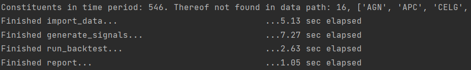
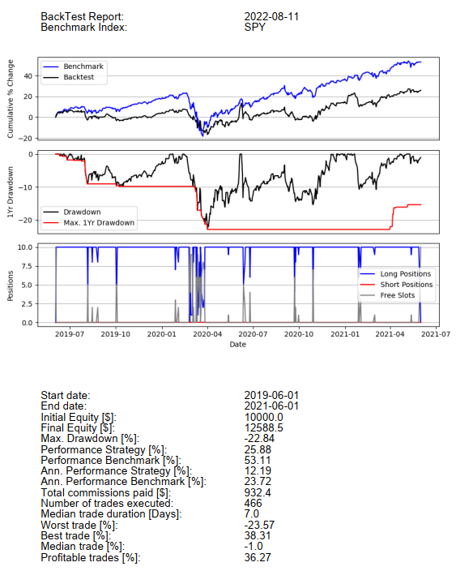
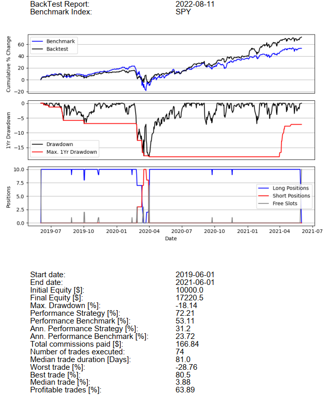
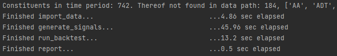
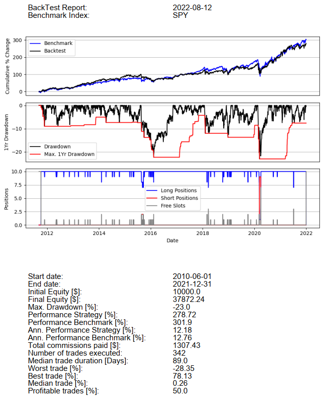

User Manual
***********

This is the user manual of the **`ndxtest`** package.
The repository is available on `GitHub <https://github.com/lksdnx/ndxtest>`_

Scope and Limitations
---------------------
The `ndxtest` package seeks to make the backtesting of trading strategies accessible. In its current version (0.0.1)
the package is quite specialized and in many ways limited:

- Backtesting is performed on the basket of stocks included in the S&P 500 index. The necessary data is available in the packages GitHub repository.
- `ndxtest` uses daily price data. Other timeframes are not implemented. This comes with a number of limitations as to what kind of trading strategies can be built with `ndxtest`.
- The trades are entered/exited on the open of the day after signal completion. This is the only mode currently implemented. End of day will be implemented ASAP.
- The codebase is currently not subject to systematic unit-testing. This will be implemented in coming versions.

Future versions of `ndxtest` aim to provide more generalized and thoroughly tested toolsets, while still trying to keep it
simple for users.

Installation
------------

- Install Python version 3.9 or higher `here <https://www.python.org/downloads/>`_.
- Install a code editor of your choice. Google: 'Python IDE'
- Install `git <https://git-scm.com/downloads>`_ to easily download the required `data <https://github.com/lksdnx/ndxtest/tree/master/data>`_ from the repository.
- **Allow both Python and git to be added to the ``Path``** during their respective installations.

| Consider first setting up a Python virtual environment as you might not want to
| install `ndxtest` within your main package library. Anyways... go to the python
| console and install `ndxtest` like so:

``pip install ndxtest``

`ndxtest` needs daily price data for companies included in the S&P 500. The data can be downloaded from the `ndxtest`
GitHub repository. `ndxtest` comes with a set of tools that allows users to maintain and update their own copy to the data.
More on that later, however, new versions of the data will be available every other month on the GitHub repository.

| If you have `git` installed, open a terminal and navigate (``cd``) to your favorite directory.
| Then, paste the following **line by line** into the terminal:

| ``git clone --depth 1 --filter=blob:none --sparse https://github.com/lksdnx/ndxtest``
| ``cd ndxtest``
| ``git sparse-checkout set data``

| This will download the `data <https://github.com/lksdnx/ndxtest/tree/master/data>`_ from the GitHub repo.
| You can delete the .git folder after. Keep the data.

Updating the Library
--------------------

| Before we can start building our first strategy with `ndxtest`,
| we first have to make sure that the data we are working with is updated
| and includes the most recent days and weeks of price development.

| `ndxdest` has three modules: `backtest`, `indicators` and `utils`.
| :class:`ndxtest.utils.LibManager` will help with updating the library.
| You can read more on the other modules beneath and in the technical documentation later.

Create a new .py file in your code editor and

``from ndxtest.utils import LibManager``

``lm = LibManager('C:\\Users\\user\\absolute\\location\\of\\data')``

This will raise errors if the required directories and contents are not found in the path.

As of now, the updating process is not fully automated...
The process involves three steps:

1. Checking for S&P index announcements on `www.spglobal.com <https://www.spglobal.com/spdji/en/indices/equity/sp-500/#news-research>`_.
2. Updating `data\\lib\\^HIST.xlsx` (the `histfile`).
3. Running the update. Takes about 5 min., during which you need to sit in front of the screen because user input may be required.

The index announcements given on spglobal.com will include index additions/removals and mergers/spinoffs.

.. warning::
   Ticker symbol name changes can occur as well. Most time, these are not announced by spglobal.

Lets say that since the last update 'FOO' replaced 'BAR' in the index, 'BAZ' had a rebranding
and is now trading under ticker symbol 'QUX' and 'JE' acquired (the S&P 500 listed company) 'EZ'
and is now trading under ticker symbol 'JEEZ'. The following would do the job (do not actually paste this):

| ``lm.histfile_new_entry('add', 'FOO', '2022-06-06')``
| ``lm.histfile_new_entry('remove', 'BAR', '2022-06-06')``
| ``lm.lib_rename_symbol('BAZ', 'QUX')``
| ``lm.histfile_new_entry('remove', 'JE', '2022-06-23')``
| ``lm.histfile_new_entry('remove', 'EZ', '2022-06-23')``
| ``lm.histfile_new_entry('add', 'JEEZ', '2022-06-23')``

:func:`LibManager.lib_update.lib_rename_symbol` renames the symbol in the `histfile` as well as the .csv file
in the \lib directory. Now we can run the update of the library using :func:`LibManager.lib_update`.
Set the new `new_entries` parameter to the number of new entries that have been added to the `histfile`
since the last update. If the last update was more than 3 months ago, set the `period` parameter to '6mo' or '1y', respectively.

``lm.update_lib(period='3mo', new_entries=5)``

The updating function uses the very nice `yfinance <https://pypi.org/project/yfinance/>`_ package.
Yfinance provides an interface to the finance.yahoo.com API, from which daily price data can be downloaded for free.

First, a backup `data\\lib_backup_YYYY-MM-DD` is created. Then, `update_lib` appends new records to all `active`
symbols in `data\\lib`. By default, 5 years worth of daily price data will be downloaded if a .csv file is not yet present.
A delay of .3 sec per request prevents the API from limiting user access, however, it slows down the process.
The data provided by finance.yahoo includes stock splits, which are automatically processed in the already present .csv files.

.. warning::
   If you read the following in your console: 'Error processing FB... (symbol may be delisted or a name change may have occurred).'
   Go to Google and find out whether FB maybe had a name change. Continue the current update. If a name change has occurred run:
   ``lm.lib_rename_symbol('FB', 'META')``, then run ``lm.update_lib(period='3mo', symbols='META')`` to update 'META' and ignore
   all other symbols.

.. note::
   If `LibManager.update_lib` encounters situations it does not know how to handle it will request
   Y/N user input. For the 5 minutes the update will take you should watch the screen from time to time.

.. note::
   If you have the feeling that something went wrong in the process you can delete the `lib` folder and rename the backup
   folder to `lib`.

.. warning::
   It is recommended to update the library at least once every one to two months, otherwise one risks data becoming inaccessible.
   Especially, finance.yahoo will delist acquired companies some time after the transaction. Any missing price data
   for the acquired company before the transaction took place then becomes inaccessible for download.

Building a Strategy
-------------------

A script (`tutorial.py`) containing all the lines of code hereafter exists in the `docs <https://github.com/lksdnx/ndxtest/tree/master/docs>`_ of the repo.

Now that the data is up to date we can build a first strategy. Strategies are built using :class:`ndxtest.utils.Strategy`
as well as some of the indicator functions found in :mod:`ndxtest.indicators`. An instantiated Strategy object has to
be fed with sets of conditions for 4 things:

1. conditions for entering long positions >> `Strategy.enter_long_if`
2. conditions for exiting long positions >> `Strategy.exit_long_if`
3. conditions for entering short positions >> `Strategy.enter_short_if`
4. conditions for exiting short positions >> `Strategy.exit_short_if`

All of the 4 **condition sets** can include arbitrary numbers of elementary conditions
All elementary conditions have to be ``True`` to generate a signal.

An elementary condition consists of three parameters: `day`, `condition`, `use_index`, where...

- `day` is the day on which the condition must be true. -1 is one day before signal completion. 0 is the day of signal completion. **Positions are opened on the open of day +1**.
- `condition` is the condition. In most cases represented by one or several indicator functions wrapped by a lambda function.
- `use_index` is either ``True`` or ``False``. By default, it is ``False`` and can be omitted. If the parameter is set to ``True`` the strategy will check if the condition is True for the S&P500 index, not for the individual stock.

For a list of indicators currently available refer to the technical documentation of indicators.py. For the first
example strategy here, we will use the relative strength index `rsi` the simple moving average `sma` and the
`crossover` function. However, we will import all indicators for now.

| ``from ndxtest.backtest import Strategy``
| ``from ndxtest.indicators import *``
|
| ``s1 = Strategy()``
| ``s1.enter_long_if(0, lambda x: crossover(50, rsi(x), 'bullish'))``
| ``s1.enter_long_if(0, lambda x: x.close > sma(x, 20))``
|
| ``s1.exit_long_if(0, lambda x: crossover(sma(x, 20), x.close, 'bearish'))``

This translates into:
- Buy when the RSI rises above 50 and at the same time the closing price is higher than the 20 period SMA.
- Sell when the price closes beneath the 20 Period SMA.

The variable ``x`` refers to a :class:`pd.DataFrame` containing ohlc data of an individual stock or of the index, respectively.
You can use: ``x.open``, ``x.high``, ``x.low``, ``x.close`` and ``x.volume``.

This simple strategy generates lots of signals and with a universe of 500 stock in an upmarket,
you will fully invested for most of the time.

.. note::
   Take care not to combine any mutually exclusive elementary conditions or you will end up with no signals.

Running the Backtest
--------------------

Lets have a look at the results of ``s1``.

| ``bt1 = BackTest('C:\\Users\\user\\absolute\\location\\of\\data')``
| ``bt1.import_data(start_date='2019-06-01', end_date='2020-06-01', lag=200)``

.. note::
   Upon initialization of a BackTest instance, a timestamped (YYYY-MM-DD_HH-MM-SS) output folder is created
   in the `data\\` directory.

.. note::
   In the example above, `lag=200` tells the BackTest instance to import an additional 200 days of price data
   preceding the `start_date`. This is needed for proper calculation of lagging indicators such as moving
   averages. If your strategy uses indicators that lag more than 200 days, e.g. a 300 day moving average,
   you need to increase the lag, respectively. 200 is the default, so in most cases the `lag` parameter can be omitted.

The chosen time period includes the corona crash. Lets see how our strategy performs.

| ``bt.generate_signals(s1)``
| ``bt.run_backtest()``
| ``bt.report()``

.. note::
   ``run_backtest()`` has a number of parameters, all of which have default values. For example, you can increase
   the maximum number of positions in your portfolio. Please refer the technical documentation.

The output folder now contains `backtest_report.pdf`, `equity_curve.csv` and `tradelog.csv`. `equity_curve.csv` contains
the ohlc absolute market value development of the portfolio during the backtest. A plot of the relative development
compared to the index is shown in the `backtest_report.pdf`. `tradelog.csv` is a log of all trades taken during the backtest.

The `backtest_report` should look like this:

We do have a small profit but we dramatically underperformed the index. Before we try to improve on this, lets talk
about a few technical details.

- Some strategies frequently produce a lot of signals on one day, while producing little or no signals on most other days.
  At the moment, a mechanism for ranking the signals so that from lets say 20 signals the *best* ones measured by some metric
  are taken first, is **not implemented**. This will be one of the first new features in upcoming versions of ndxtest.
  At the moment, the signals are taken alphabetically. Lets say the portfolio has only two slots left but there are buy
  signals for 'AAPL', 'META' and 'GOOG'. Positions in 'AAPL' and 'GOOG' but not 'META' will be initiated.
- If a long Position in a given symbol already exists, new long entry signals for this symbol will be ignored and vice versa.
- If a short entry signal for a given symbol occurs but there already exists a long position in this symbol,
  *no short position will be opened*. This is a design choice. A more aggressive way would be to close the existing
  long position and at the same time open a new short position. The optionality may be implemented in future releases.
- The same applies vice versa. A new long entry signal will not open a new long position if an existing short position
  in the same symbol exists.
- Also read about the `max_trade_duration` and `stoploss` parameters of the `run_backtest()` class method. They both
  represent additional methods to close positions irrespective of the signals provided by the strategy.

Now lets try to improve on ``s1`` and build ``s2``:

| ``s2 = Strategy()``
| ``s2.enter_long_if(0, lambda x: crossover(50, rsi(x), 'bullish'))``
| ``s2.enter_long_if(0, lambda x: x.close > sma(x, 20))``
| ``s2.enter_long_if(1, lambda x: x.open > prev(x.close))``

| ``s2.exit_long_if(0, lambda x: crossover(sma(x, 70), sma(x, 20), 'bearish'))``

| ``s2.enter_short_if(0, lambda x: crossover(40, rsi(x), 'bearish'))``
| ``s2.enter_short_if(0, lambda x: roc(x, 5) < -0.08, True)``

| ``s2.exit_short_if(0, lambda x: roc(x, 10) > 0.1, True)``

Translating into:
- Enter long when the RSI bullishly crosses the 50 level and at the same time the closing price is higher than the 20 period SMA.
- Additionally, at the day of initiating the position (1), the opening price must be higher than the previous closing price.
- Close long positions when 20 period SMA bearishly crosses the 70 period SMA. (more slack than s1)
- Enter short if the RSI bearishly crosses the 40 level and at the same time the index (True) has lost 8% or more in the last 5 days.
- Cover short positions is the index rises by 10% or more within the last 10 days.

Now we could do ``bt1.generate_signals(s2)`` but we use a new instance of
:class:`ndxtest.backtest.BackTest` in order to get a new output directory:

| ``bt2 = BackTest('C:\\Users\\lukas\\PycharmProjects\\spy\\data')``
| ``bt2.import_data(start_date='2019-06-01', end_date='2021-06-01')``
| ``bt2.generate_signals(s2)``
| ``bt2.run_backtest(stoploss=0.10)``
| ``bt2.report()``

.. note::
   Note that this time we are also using a stoploss of 10%. The stop loss threshold is always relative to the entry price.
   Stop loss signals are generated **on the open** and are directly executed before any other signals generated by the strategy are considered

The result should look like this:

| Wow, we outperformed the S&P 500 index but wait...
| Actually this strategy was tailored to perform well during the corona crash.
| From the future it is easy to fine tune a strategy to a specific backtesting time period.

Lets see how the same strategy performs on a much longer time period:

| ``bt3 = BackTest('C:\\Users\\lukas\\PycharmProjects\\spy\\data')``
| ``bt3.import_data(start_date='2010-01-01', end_date='2021-12-31')``
| ``bt3.generate_signals(s2)``
| ``bt3.run_backtest(stoploss=0.10)``
| ``bt3.report()``

Albeit the strategy did not beat the index, but this is actually not terrible. However, there was significant
survivorship bias at play here. Of 742 symbols that were included in the index during the time period, 184 were
not in the library. Buying an ETF on the index would have been better and much easier though.
The truth is, finding a strategy that beats the S&P 500 index - especially with the tools at hand here - is very hard.

More Examples and Remarks
-------------------------

Before concluding the manual/tutorial, here are some more examples of and remarks on what can be done using the
indicators and functions provided in `ndxtest.indicators`.

:func:`prev` provides useful syntactic sugar to compare the current with the previous candle.
``prev(x.close)`` is equivalent to ``x.close.shift(1)`` but it reads much better when writing conditions:
``lambda x: x.close > prev(x.close)`` for example can be used in many way using other operators and other datapoint such as ``x.low`` or ``x.high``

Some specific candlesticks have corresponding functions in `ndxtest.indicators` (see Technical Documentation).

| ``s = Strategy()``
| ``s.enter_long_if(-2, green_candle)``
| ``s.enter_long_if(-1, green_candle)``
| ``s.enter_long_if(0, bullish_pin_bar)``
| ``s.enter_long_if(1, x.open > prev(x.close))``

Generates long entry signals if a two green candles are followed by a bullish pin bar AND on the day of position initiation (1) the opening price is
higher than the previous close.

.. note::
   You can enter arbitrary positive numbers, however, the signal completes with day 0 and the position is initiated at day 1.
   If anything, only conditions concerning the open of the 1 make sense, everything beyond that would require knowledge of the future and
   therefore does not make sense.

There are two indicator functions: the bollinger bands (bbands) and the moving average convergence divergence (macd)
that output a tuple of :class:`pd.Series` instead of one :class:`pd.Series`. Please refer to the technical documentation
before using these indicators. For example ``bbands(x)[0]`` would access a 20 period SMA (standard for bollinger band calculation), while
``bbands(x)[1]`` would access the lower and ``bbands(x)[2]`` would access the upper bollinger band.

``s.enter_long_if(0, lambda x: x.closes > bbands(x)[2])``

Translates to: Enter long when the price closes above the upper bollinger band of the 20 period SMA.

| I hope this tutorial was enjoyable!
| If yes and if you like the package,
| I would appreciate a star on https://github.com/lksdnx/ndxtest

.. toctree::
   :maxdepth: 2
